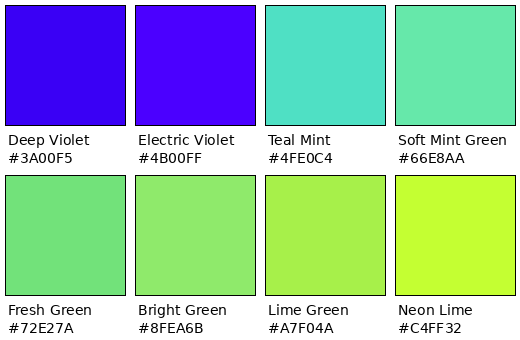

===========================
Qorix Product User Manual
===========================

.. list-table::
   :widths: 30 70
   :header-rows: 0

   * - **Document Type**
     - User Manual (Sample)
   * - **Product**
     - <Product Name>
   * - **Version**
     - 0.1.0
   * - **Prepared for**
     - <Customer Name>
   * - **Classification**
     - Customer Deliverable

.. contents:: Table of Contents
   :depth: 2
   :local:

Introduction
============

This manual describes how to install, configure, and operate
<Product Name>. It is intended for end users and system operators and
assumes no prior familiarity with the product's internal architecture.

Scope
-----

This document covers day-to-day operation of the product. For
architecture, requirements, and safety/cybersecurity case documentation,
refer to the corresponding organizational governance and traceability
documents supplied separately.

Getting Started
================

System Requirements
--------------------

- Supported operating systems: <list>
- Minimum hardware: <list>
- Required dependencies: <list>

Installation
------------

#. <Step one>
#. <Step two>
#. <Step three>

First-Time Setup
-----------------

<Describe initial configuration steps here.>

Using the Product
==================

Core Workflow
-------------

<Describe the primary user workflow here.>

Configuration Reference
------------------------

.. list-table::
   :header-rows: 1
   :widths: 25 25 50

   * - Setting
     - Default
     - Description
   * - <setting_name>
     - <default_value>
     - <what it controls>

Troubleshooting
================

.. list-table::
   :header-rows: 1
   :widths: 30 70

   * - Symptom
     - Resolution
   * - <symptom>
     - <resolution steps>

Support
=======

For issues not covered in this manual, contact Qorix support at
<support_email> or raise a ticket through <support_portal>.

Appendix A — Qorix Brand Palette
==================================

The table below lists the official Qorix brand color palette used in
this and related customer-facing documents.

This image renders identically in both the PDF and HTML builds (unlike an
HTML color table, which Pandoc silently drops when targeting PDF). The
table below is a plain-text/searchable fallback of the same values.

.. list-table::
   :header-rows: 1
   :widths: 50 50

   * - Color Name
     - HEX Code
   * - Deep Violet
     - #3A00F5
   * - Electric Violet
     - #4B00FF
   * - Teal Mint
     - #4FE0C4
   * - Soft Mint Green
     - #66E8AA
   * - Fresh Green
     - #72E27A
   * - Bright Green
     - #8FEA6B
   * - Lime Green
     - #A7F04A
   * - Neon Lime
     - #C4FF32
